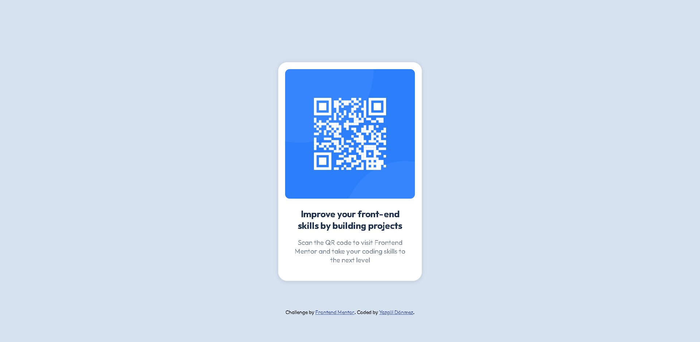

# Frontend Mentor - QR code component solution

 [solution](https://www.frontendmentor.io/solutions/qr-code-component-using-html-and-css-l6W9uaO5wA) | [live](https://yazguldonmez.github.io/frontend-mentor/qr-code-component-main/)

## Welcome! 👋

This is a solution to the [QR code component challenge on Frontend Mentor](https://www.frontendmentor.io/challenges/qr-code-component-iux_sIO_H). Frontend Mentor challenges help you improve your coding skills by building realistic projects. 

## Table of contents
- [Overview](#overview)
  - [Screenshot](#screenshot)
  - [Links](#links)
- [My process](#my-process)
  - [Built with](#built-with)
- [Author](#author)

## Overview

### Screenshot

### Links

- Solution URL: [solution URL](https://www.frontendmentor.io/solutions/qr-code-component-using-html-and-css-l6W9uaO5wA)
- Live Site URL: [live site URL](https://yazguldonmez.github.io/frontend-mentor/qr-code-component-main/)

## My process

### Built with

- Semantic HTML5 markup
- CSS custom properties
- Flexbox
- Mobile-first workflow

## Author

- Frontend Mentor - [@yazguldonmez](https://www.frontendmentor.io/profile/yazguldonmez)
